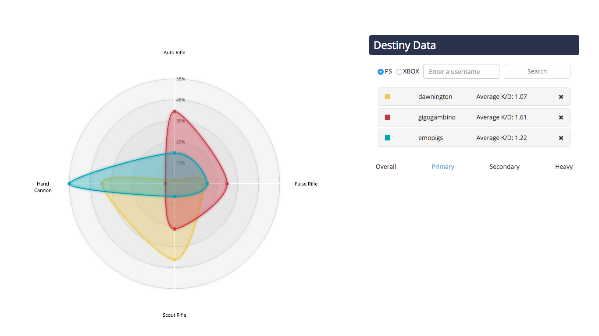

# Destiny Data

[Live on Heroku](https://destiny-data.herokuapp.com/)

A simple site that uses the Bungie API to fetch and display PvP stats as percentages, inspired by this [Reddit post](https://www.reddit.com/r/CruciblePlaybook/comments/4rp01r/ideal_breakdown_of_kill_types/) and [featured on Game Rant](http://gamerant.com/destiny-pvp-stat-site-311/).

Built using React/flux, Express, and [D3.js](https://d3js.org/).

Many thanks to [chrisfried](https://github.com/chrisfried/secret-scrubland) for giving me the base to work off of. Check out [his app](https://secret-scrubland-31430.herokuapp.com/) if you haven't already (and if you want to feel bad about how much time you've spent on Destiny).

`routes/index.js` requires a [Bungie API Key](https://www.bungie.net/en/User/API)
